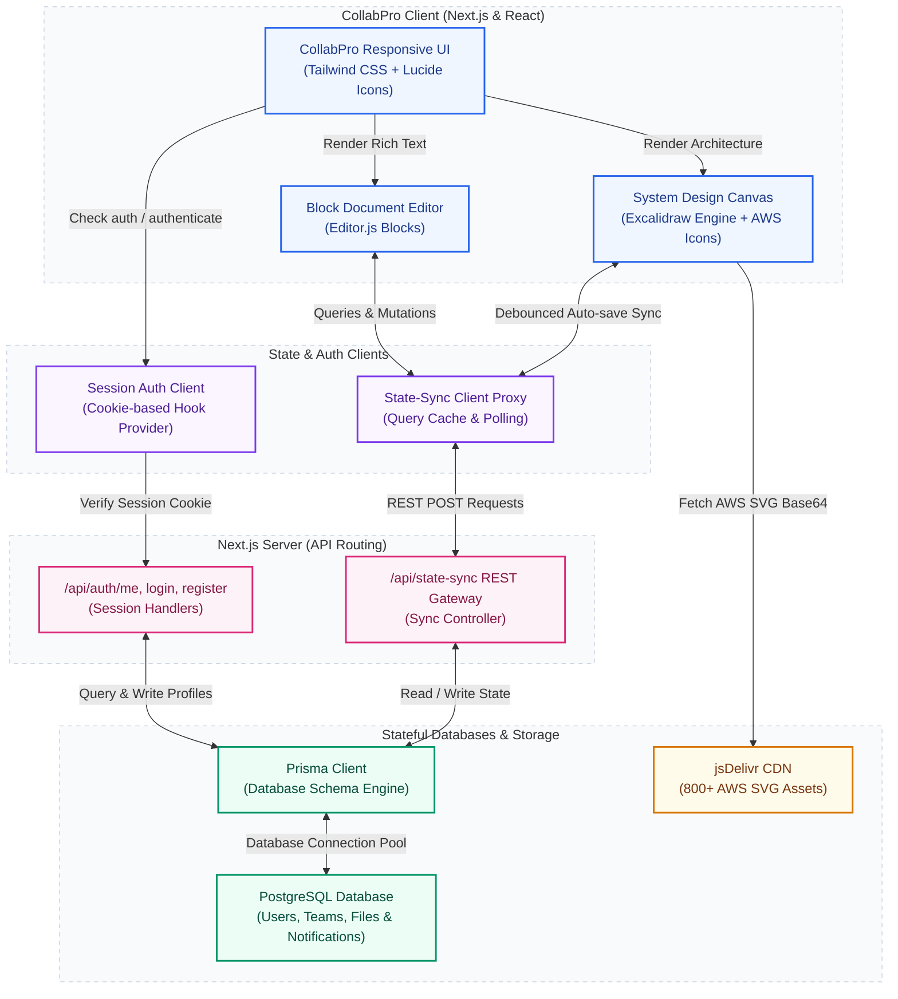

# 🚀 CollabPro

[](https://nextjs.org/)
[](https://postgresql.org/)
[](https://github.com/manish-9245/collabpro)
[](LICENSE)

CollabPro is a premium, open-source collaborative whiteboard and system design workspace. It combines a real-time Markdown document editor side-by-side with an infinite collaborative engineering canvas equipped with standard flowchart shapes and 800+ standard AWS service and resource SVG icons. Group files into nested directories, invite team members, accept org memberships with secure notification invites, restore states via version checkpoints, and map your system architecture with flawless drag-and-drop mechanics.

CollabPro is engineered to be **completely self-contained with 100% zero external SaaS dependencies**. There is no need for third-party Convex DB, Clerk, or Kinde API keys. It runs entirely on your own database using a custom native state-sync gateway and session authentication engine, making it secure, ultra-fast, and ready for instant deployment.

---

## 🎨 Core Features

### 📝 1. Rich Collaborative Document Editor
- **Editor.js Blocks**: Responsive block-based document editing featuring custom paragraphs, checklists, headers, and bullet lists.
- **Bi-directional Split Screen**: Work simultaneously with a live documents panel on the left and a system design canvas on the right.
- **Syncing & Cache**: State auto-saves dynamically with custom save intervals and state caching to prevent network collisions.

### 📐 2. Infinite Collaborative Canvas
- **Excalidraw Engine Integration**: High-performance canvas supporting standard vector nodes, freehand sketching, custom colors, grouping, alignment, and export.
- **Unified Design Assets Sidebar**: A beautifully aligned, fully integrated right-side sidebar organizing drawing shapes across tabbed categories: Standard, AWS, Custom, and Library.
- **Dynamic Vector Icon Previews**: On-the-fly vector coordinate parsing using a custom preview renderer that calculates real-time bounding boxes and scales complex `.excalidrawlib` shapes into elegant inline SVG icons inside a premium 2-column grid.
- **800+ Searchable AWS Icons**: Search, filter, and drag-and-drop over 800 high-resolution AWS architecture or resource SVG nodes directly from the sidebar onto the canvas.
- **Drag-and-Drop Coordinate Mapping**: Drop AWS elements or standard flow nodes exactly where your cursor releases relative to viewport zoom and panning scroll states.
- **Atomic Rendering**: Immediate, lag-free file-data loading so you never see blank or broken shapes.
- **Collapsible Design Sidebar**: One-click collapsible panel header that hides the right-side library seamlessly to maximize focus and canvas real estate.

### 📁 3. File & Nested Folder Tree Navigation
- **Directory Hierarchy**: Create and map files into parent folders or deeply nested subfolders.
- **Actions Menu**: Rename folders across all matching documents dynamically, and rename, archive, move, or permanently delete files inside a polished context menu.

### 👥 4. Multi-Tenant Team & Membership Security
- **Dual-Approval Notification Invites**: Add members to teams or organizations and allow them to accept/decline invites in a dedicated notification tab.
- **Settings Dashboard**: Switch seamlessly between active memberships and profile sections.
- **Premium Avatars**: Select animated, popular premium avatars to personalize your collaborator workspace profile.

---

## 🏗️ System Architecture

The following Mermaid diagram outlines the high-level request lifecycle, state replication, and database synchronization behind CollabPro's high-performance native architecture:



---

## 🛠️ Technology Stack

- **Frontend**: Next.js 14 (App Router), React 18, Tailwind CSS, Lucide icons
- **Database ORM**: Prisma Client (with PostgreSQL database driver)
- **State Replication**: Local optimistic pooling state synchronization gateway
- **Authorization**: Custom stateful session-cookie authentication engine
- **Document Engine**: Editor.js (Blocks-based nested plugins)
- **Canvas Engine**: `@excalidraw/excalidraw` (Vector system design layout)

---

## 🚀 Getting Started

### 📋 Prerequisites
Ensure you have the following installed on your developer machine:
- Node.js (version 20 or higher)
- PostgreSQL database instance

### 📦 1. Clone & Install Dependencies
```bash
git clone https://github.com/manish-9245/collabpro.git
cd collabpro
npm install
```

### 🔑 2. Environment Setup
Create a `.env` or `.env.local` file in the root directory and supply your PostgreSQL connection string:

```env
# Database Credentials
DATABASE_URL="postgresql://<user>:<password>@<host>:<port>/collabpro?schema=public"
```

> [!NOTE]
> CollabPro does not require any third-party auth provider (like Clerk or Kinde) or real Convex cloud databases. All functionalities are natively handled by PostgreSQL and your Next.js server!

### 🗃️ 3. Initialize Database Schema
Push the schema structure directly to your PostgreSQL database:
```bash
npx prisma db push
```

### 💻 4. Launch Local Dev Server
```bash
npm run dev
```
Open [http://localhost:3000](http://localhost:3000) to view your self-hosted CollabPro workspace in action.

---

## 🌐 Production Deployment

### Railway Deployment Rules
- Make sure the `DATABASE_URL` environment variable is defined in your deployment dashboard settings.
- Do NOT run database migration triggers during build time as it might block. Run `npx prisma db push` beforehand or let the start trigger handle it natively.
- Build and run the production Next.js bundle:
```bash
npm run build
npm run start
```

---

## 💖 Acknowledgements & Credits

CollabPro is built on top of and made possible by several incredible open-source projects, and we owe them a special debt of gratitude:

- **[Excalidraw](https://github.com/excalidraw/excalidraw)**: A massive thanks to the Excalidraw team for their outstanding, world-class virtual whiteboard library. Their robust vector graphics canvas engine enables the seamless, high-fidelity collaborative system diagramming experience that forms the core of CollabPro.
- **[Editor.js](https://github.com/codex-team/editor.js)**: For providing the exceptional block-styled extensible editor engine which powers CollabPro's rich document editor experience.
- **AWS Simple Icons**: For the comprehensive library of architecture and service icons that make technical system design smooth and professional.

---

## 📄 License
Distributed under the MIT License. See [LICENSE](LICENSE) for details.

