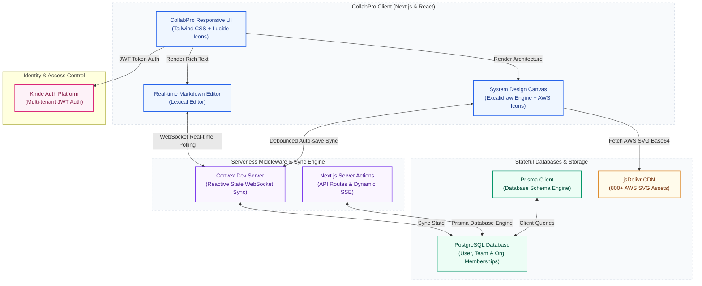

# 🚀 CollabPro

[](https://nextjs.org/)
[](https://convex.dev/)
[](https://prisma.io/)
[](https://kinde.com/)
[](LICENSE)

CollabPro is a premium, open-source collaborative workspace and system design platform. It combines a real-time markdown document editor alongside an infinite collaborative engineering canvas equipped with standard flowchart elements and 800+ standard AWS service and resource SVG icons. Group files into nested directories, invite team members, accept org memberships with secure notification invites, restore state via version checkpoints, and map your system architecture with flawless drag-and-drop mechanics.

---

## 🎨 Core Features

### 📝 1. Rich Collaborative Document Editor
- **Lexical Engine**: Responsive real-time rich-text markdown writing.
- **Bi-directional Split Screen**: Work simultaneously with a live documents panel on the left and a system design canvas on the right.
- **Syncing & Debounce**: State auto-saves dynamically with custom save intervals to prevent network collision.

### 📐 2. Infinite Collaborative Canvas
- **Excalidraw Engine Integration**: Standard vector nodes, freehand sketching, colors, grouping, alignment, and export.
- **800+ AWS Icons System**: Drag or click to inject high-resolution AWS architecture or resource SVG nodes directly from a searchable, paginated sidebar.
- **Drag-and-Drop Coordinate Mapping**: Drop AWS elements or standard flow nodes exactly where your cursor releases relative to viewport zoom and panning scroll states.
- **Atomic Rendering**: Immediate, lag-free file-data loading so you never see blank or broken shapes.
- **Collapsible Elements Panel**: One-click collapsible sidebar header allowing full canvas usage.

### 📁 3. File & Nested Folder Tree Navigation
- **Directory Hierarchy**: Create and map files into parent folders or deeply nested subfolders.
- **Actions Menu**: Rename folders across all matching documents dynamically, and rename, archive, move, or permanently delete files inside a polished context menu.

### 👥 4. Multi-Tenant Team & Membership Security
- **Dual-Approval Notification Invites**: Add members to teams or organizations and allow them to accept/decline invites in a dedicated notification tab.
- **Settings Dashboard**: Switch seamlessly between active memberships and profile sections.
- **Premium Avatars**: Select animated, popular premium avatars to personalize your collaborator workspace profile.

---

## 🏗️ System Architecture

The following Mermaid diagram outlines the high-level request lifecycle, state replication, and data stores behind CollabPro:



---

## 🛠️ Technology Stack

- **Frontend**: Next.js 14 (App Router), React 18, Tailwind CSS, Lucide icons, Framer Motion
- **Database ORM**: Prisma Client (with PostgreSQL pool proxy)
- **Real-Time Replication**: Convex reactive state engine (WebSockets replication)
- **Authorization**: Kinde Auth API (secure session JWTs)
- **Canvas Engine**: `@excalidraw/excalidraw`

---

## 🚀 Getting Started

### 📋 Prerequisites
Ensure you have the following installed on your developer machine:
- Node.js (version 20 or higher)
- PostgreSQL database instance

### 📦 1. Clone & Install Dependencies
```bash
git clone https://github.com/manish-9245/collabpro.git
cd collabpro
npm install
```

### 🔑 2. Environment Setup
Create a `.env.local` or `.env` file in the root directory and supply your PostgreSQL connection string:

```env
# Database Credentials
DATABASE_URL="postgresql://<user>:<password>@<host>:<port>/collabpro?schema=public"
```

> [!NOTE]
> CollabPro features a built-in local emulation layer for Kinde Authentication and Convex state sync. No third-party accounts or secrets are required for these systems.

### 🗃️ 3. Initialize Prisma Database Schema
Push the schema structure to your PostgreSQL database:
```bash
npx prisma db push
```

### 💻 4. Launch Local Dev Server
```bash
npm run dev
```
Open [http://localhost:3000](http://localhost:3000) to view the application in action.

---

## 🌐 Production Deployment

### Vercel / Railway Deployment Rules
- Make sure the `DATABASE_URL` environment variable is defined in your deployment dashboard settings.
- Do NOT run database migration triggers during build time as it might block. Run `npx prisma db push` beforehand or via custom runtime deployment hooks.
- Deploy the production Next.js bundle:
```bash
npm run build
```

---

## 📄 License
Distributed under the MIT License. See [LICENSE](LICENSE) for details.
