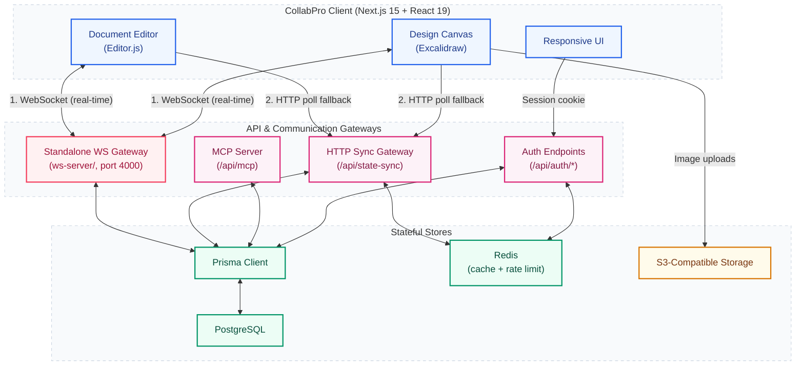

# 🚀 CollabPro

[](https://nextjs.org/)
[](https://react.dev/)
[](https://postgresql.org/)
[](https://redis.io/)
[](https://github.com/manish-9245/collabpro)
[](LICENSE)

CollabPro is a self-hosted collaborative whiteboard and system design workspace. It combines a real-time Markdown document editor side-by-side with an infinite collaborative engineering canvas equipped with standard flowchart shapes and 800+ AWS service/resource SVG icons. Group files into nested directories, invite team members, accept org memberships via notification invites, restore states via version checkpoints, and map your system architecture with drag-and-drop.

CollabPro is **self-contained with zero required third-party SaaS dependencies** — no Convex, Clerk, or Kinde API keys needed. It runs on your own PostgreSQL database, Redis, and (optionally S3-compatible) object storage, using a native state-sync gateway and session authentication engine.

---

## 🎨 Core Features

### 📝 1. Rich Collaborative Document Editor
- **Editor.js Blocks**: Responsive block-based document editing featuring custom paragraphs, checklists, headers, and bullet lists.
- **Bi-directional Split Screen**: Work simultaneously with a live documents panel on the left and a system design canvas on the right.
- **Syncing & Cache**: State auto-saves dynamically, with a shared client-side query cache to prevent redundant fetches and network races.

### 📐 2. Infinite Collaborative Canvas
- **Excalidraw Engine Integration**: High-performance canvas supporting standard vector nodes, freehand sketching, custom colors, grouping, alignment, and export.
- **Unified Design Assets Sidebar**: A right-side sidebar organizing drawing shapes across tabbed categories: Standard, AWS, Custom, and Library.
- **800+ Searchable AWS Icons**: Search, filter, and drag-and-drop over 800 high-resolution AWS architecture/resource SVG nodes onto the canvas.
- **Drag-and-Drop Coordinate Mapping**: Drop elements exactly where your cursor releases relative to viewport zoom and pan.
- **Collapsible Design Sidebar**: One-click collapse of the right-side library to maximize canvas space.
- **Full-Text Vector Search**: Search across all drawings, text nodes, and diagrams in the workspace.
- **S3-Backed Canvas Image Uploads**: Pasted/dropped images are uploaded to S3-compatible object storage and referenced by short URL, keeping raw image data out of Postgres.

### 📁 3. File & Nested Folder Tree Navigation
- **Directory Hierarchy**: Create and map files into parent folders or deeply nested subfolders.
- **Actions Menu**: Rename, archive, move, or permanently delete files and folders from a context menu.

### 👥 4. Multi-Tenant Team & Membership Security
- **Dual-Approval Notification Invites**: Add members to teams or organizations; invitees accept/decline from a dedicated notification tab.
- **Settings Dashboard**: Switch between active memberships and profile sections.
- **Rate-Limited Auth**: Login, registration, and share-link password verification are rate-limited (Redis-backed across replicas, with an in-memory fallback) against credential stuffing — see [`docs/architecture.md`](docs/architecture.md#5-rate-limiting-librate-limiterts).

### ⚡ 5. State-Sync & Performance Foundation
- **WebSocket-First, Poll-Fallback**: Real-time sync over WebSockets when available, with automatic HTTP polling fallback for restrictive networks.
- **Smart Active-Backoff Polling**: Fallback polling scales from 4s to 15s during tab-blur or 60+ seconds of inactivity, and resumes instantly on interaction.
- **Redis Cache-Aside Reads**: File reads are cached in Redis with write-path invalidation; falls through to Postgres transparently if Redis is unavailable.

### 🤖 6. MCP Automation Tools
- **Spec-compliant remote server**: `/api/mcp` is a real Streamable HTTP MCP server built on the official `@modelcontextprotocol/sdk` — any supporting client (including VS Code natively, via the bundled `.vscode/mcp.json`) connects directly with just a URL and API key, no local install.
- **stdio bridge for legacy clients**: `scripts/mcp-server.ts` bridges local stdio clients (Claude Desktop, Cursor, Windsurf) to the same server.
- **Tools**: `collabpro_list_files`, `collabpro_get_file`, `collabpro_update_document`, `collabpro_update_whiteboard`, `collabpro_search_icon_libraries`, `collabpro_get_library_icon` — schema-validated and access-scoped to the caller's teams, writes going through the same compare-and-swap writers as every other write path in the app.
- **Enforced whiteboard layout**: `collabpro_update_whiteboard` rejects overlapping shapes / non-finite coordinates server-side (not just a suggestion in the tool description) — same rule for every calling AI. A `collabpro_diagram_guidelines` MCP **prompt** gives the full color/spacing/typography rules plus real AWS/Azure/GCP/network icon lookup, sourced from the community `.excalidrawlib` libraries.
- **Rate limited, audited, observable**: per-API-key rate limiting, an audit-log entry for every write/auth-failure, and structured request logging — see [`docs/mcp-integration.md`](docs/mcp-integration.md#reliability-limits-and-audit).
- **Full setup guide, tool/prompt reference, and troubleshooting**: [`docs/mcp-integration.md`](docs/mcp-integration.md).

---

## 🏗️ System Architecture

CollabPro is a **dual-channel, stateful real-time synchronization system**: **WebSocket-first**, with an automatic **HTTP adaptive-polling** fallback, backed by PostgreSQL, Redis, and S3-compatible object storage.


```mermaid
graph TD
    classDef client fill:#eff6ff,stroke:#2563eb,stroke-width:2px,color:#1e3a8a;
    classDef engine fill:#faf5ff,stroke:#7c3aed,stroke-width:2px,color:#4c1d95;
    classDef server fill:#fdf2f8,stroke:#db2777,stroke-width:2px,color:#831843;
    classDef ws fill:#fff1f2,stroke:#f43f5e,stroke-width:2px,color:#9f1239;
    classDef db fill:#ecfdf5,stroke:#059669,stroke-width:2px,color:#064e3b;
    classDef storage fill:#fffbeb,stroke:#d97706,stroke-width:2px,color:#78350f;

    subgraph ClientLayer ["CollabPro Client (Next.js 15 + React 19)"]
        UI["Responsive UI"]:::client
        EditorComponent["Document Editor<br/>(Editor.js)"]:::client
        CanvasComponent["Design Canvas<br/>(Excalidraw)"]:::client
    end

    subgraph GatewayLayer ["API & Communication Gateways"]
        AuthAPI["Auth Endpoints<br/>(/api/auth/*)"]:::server
        SyncAPI["HTTP Sync Gateway<br/>(/api/state-sync)"]:::server
        McpAPI["MCP Server<br/>(/api/mcp)"]:::server
        WSGateway["Standalone WS Gateway<br/>(ws-server/, port 4000)"]:::ws
    end

    subgraph DataLayer ["Stateful Stores"]
        PrismaORM["Prisma Client"]:::db
        PostgresDB["PostgreSQL"]:::db
        RedisStore["Redis<br/>(cache + rate limit)"]:::db
        S3Store["S3-Compatible Storage"]:::storage
    end

    UI -->|Session cookie| AuthAPI
    EditorComponent <-->|"1. WebSocket (real-time)"| WSGateway
    CanvasComponent <-->|"1. WebSocket (real-time)"| WSGateway
    EditorComponent -->|"2. HTTP poll fallback"| SyncAPI
    CanvasComponent -->|"2. HTTP poll fallback"| SyncAPI
    CanvasComponent -->|Image uploads| S3Store

    WSGateway <--> PrismaORM
    SyncAPI <--> PrismaORM
    SyncAPI <--> RedisStore
    AuthAPI <--> RedisStore
    McpAPI <--> PrismaORM
    AuthAPI <--> PrismaORM
    PrismaORM <--> PostgresDB

    style ClientLayer fill:#f8fafc,stroke:#cbd5e1,stroke-dasharray: 5 5;
    style GatewayLayer fill:#f8fafc,stroke:#cbd5e1,stroke-dasharray: 5 5;
    style DataLayer fill:#f8fafc,stroke:#cbd5e1,stroke-dasharray: 5 5;
```

**📖 Full architecture deep-dive** — WebSocket gateway internals, adaptive-polling backoff logic, Redis cache-aside/rate-limiting design, S3 object storage, operational endpoints: **[`docs/architecture.md`](docs/architecture.md)**.

---

## 🛠️ Technology Stack

- **Frontend**: Next.js 15 (App Router), React 19, Tailwind CSS, Lucide Icons
- **Real-Time Engine**: `ws` — standalone Node.js WebSocket gateway (`ws-server/`, port 4000 by default)
- **Database & ORM**: Prisma Client + PostgreSQL (no SQLite support)
- **Cache & Rate Limiting**: Redis (`ioredis`) — cache-aside file reads, cross-replica rate limiting
- **Object Storage**: S3-compatible (AWS SDK v3) for canvas image uploads
- **Authorization**: Custom signed-session-cookie authentication engine with multi-tenant workspace partitioning
- **Document Engine**: Editor.js (block-based)
- **Canvas Engine**: `@excalidraw/excalidraw`
- **AI Integration**: Official `@modelcontextprotocol/sdk` — see [MCP Automation Tools](#-6-mcp-automation-tools)

---

## 🚀 Getting Started

### 📋 Prerequisites
- Node.js 20+
- A PostgreSQL database and a Redis instance (the fastest way to get both locally is `docker-compose up -d postgres redis`, below)

### 📦 1. Clone & Install Dependencies
```bash
git clone https://github.com/manish-9245/collabpro.git
cd collabpro
npm install
```

### 🔑 2. Environment Setup
Copy [`.env.example`](.env.example) to `.env` and fill in real values:
```bash
cp .env.example .env
```
At minimum for local dev you need `DATABASE_URL`, `SESSION_SECRET` (required — the app won't boot without a 32+ character secret), and, if you want Redis-backed caching/rate-limiting locally, `REDIS_URL`. See the comments in `.env.example` for every variable (S3/object storage, SMTP, admin allowlist, etc.) and what each gates.

### 🐘 3. Start Postgres & Redis
The quickest path — spin up just the data stores via Docker, and run the app itself with `npm run dev` for a fast local dev loop:
```bash
docker-compose up -d postgres redis
```
(Or point `DATABASE_URL`/`REDIS_URL` at your own instances instead.)

### 🗃️ 4. Apply the Database Schema
```bash
npx prisma migrate dev
```
> [!IMPORTANT]
> Use `prisma migrate dev` (or `prisma migrate deploy` in production), not `prisma db push` — this repo tracks real migrations under `prisma/migrations/`, and `db push` skips them, which can silently desync a database from the migration history.

### 💻 5. Launch the Dev Server
```bash
npm run dev
```

### 🔌 6. Start the WebSocket Gateway
In a separate terminal:
```bash
npm run ws:start
```
Open [http://localhost:3000](http://localhost:3000) to view your self-hosted CollabPro workspace.

---

## 🌐 Production Deployment

### Option A — Docker Compose
`docker-compose.yml` at the repo root defines the full stack (Postgres, Redis, the Next.js `web` service, and the standalone `ws` WebSocket service) with health checks and resource limits already configured:
```bash
DB_PASSWORD=... SMTP_USERNAME=... SMTP_PASSWORD=... docker-compose up -d
```

### Option B — Kubernetes
See [`docs/deploy-k8s.md`](docs/deploy-k8s.md) for the full Helm-based deployment guide (EKS/GKE/AKS/minikube).

### Option C — Platform-as-a-Service (Railway, Render, etc.)
- Provision PostgreSQL and Redis, and set `DATABASE_URL` / `REDIS_URL` plus the other required variables from `.env.example`.
- Run `npx prisma migrate deploy` as a release/deploy step — **not** `prisma db push` — so the schema stays in sync with the committed migration history.
- Deploy the Next.js app (`npm run build && npm run start`) and the WebSocket gateway (`npm run ws:start`) as two separate services/processes.
- Point your platform's health check at `GET /api/health`.

---

## 📚 Docs & Contributing

- [`docs/architecture.md`](docs/architecture.md) — full architecture deep-dive
- [`docs/mcp-integration.md`](docs/mcp-integration.md) — MCP / AI agent integration setup and tool reference
- [`docs/deploy-k8s.md`](docs/deploy-k8s.md) — Kubernetes deployment guide
- [`CONTRIBUTING.md`](CONTRIBUTING.md) — how to propose and land a change
- [`SECURITY.md`](SECURITY.md) — how to report a vulnerability

---

## 💖 Acknowledgements & Credits

CollabPro is built on top of and made possible by several incredible open-source projects, and we owe them a special debt of gratitude:

- **[Excalidraw](https://github.com/excalidraw/excalidraw)**: A massive thanks to the Excalidraw team for their outstanding, world-class virtual whiteboard library. Their robust vector graphics canvas engine enables the seamless, high-fidelity collaborative system diagramming experience that forms the core of CollabPro.
- **[Editor.js](https://github.com/codex-team/editor.js)**: For providing the exceptional block-styled extensible editor engine which powers CollabPro's rich document editor experience.
- **AWS Simple Icons**: For the comprehensive library of architecture and service icons that make technical system design smooth and professional.

---

## 📄 License
Distributed under the MIT License. See [LICENSE](LICENSE) for details.
