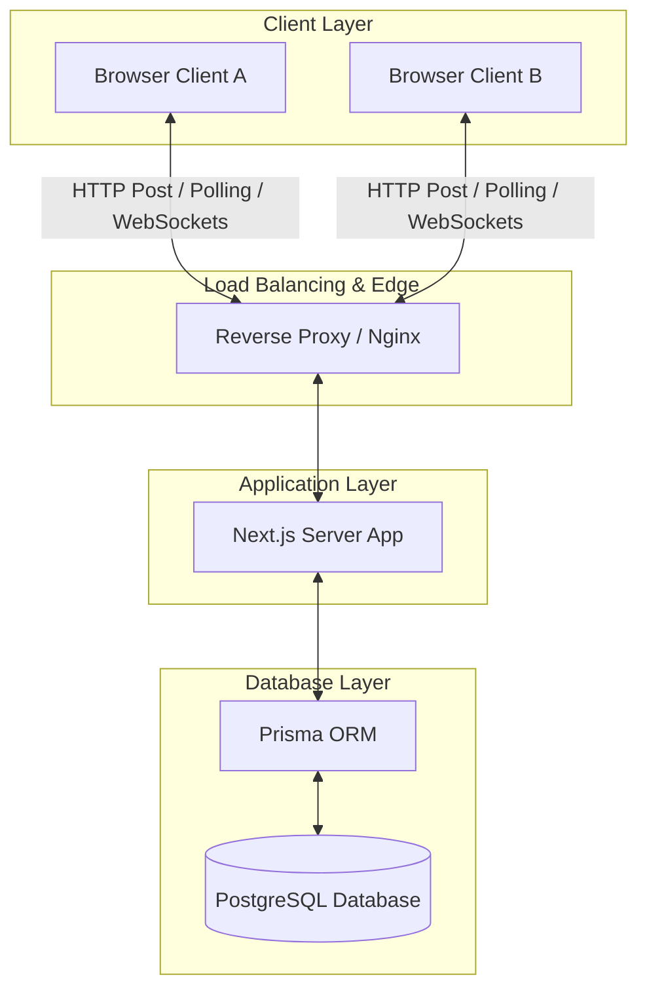
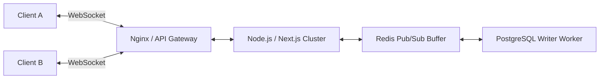

# System Design Wiki: Real-Time Collaborative Architecture

Welcome to the **CollabPro** System Design Wiki. This document explains the architectural decisions, data models, synchronization algorithms, and scaling patterns involved in building a high-performance, self-hosted, real-time collaborative workspace.

---

## 1. Architectural Overview

CollabPro is designed as a **sovereign, self-contained, and highly responsive dual-view collaborative studio**. It allows multiple concurrent users to collaborate on:
1. **Rich Text/Markdown Documents** (Block-based hierarchical editors)
2. **Infinite Whiteboard Canvases** (Vector graphics and diagramming layout)

### System Topology



---

## 2. Real-Time State Synchronization Gateway

When multiple users collaborate on a shared canvas or document, the system must resolve concurrent, conflicting updates. There are three primary paradigms for achieving this:

### 2.1 Synchronization Paradigms: Trade-Off Analysis

| Paradigm | Convergence Strategy | Advantages | Trade-offs / Drawbacks |
| :--- | :--- | :--- | :--- |
| **OT** (Operational Transformation) | Server-side sequencing and transformation of client operations (e.g., Google Docs). | Light network payloads; absolute single source of truth. | Complex server-side state machine; extremely difficult to implement and debug. |
| **CRDTs** (Conflict-free Replicated Data Types) | Mathematically mergeable data structures (e.g., Yjs, Automerge). | True peer-to-peer; offline-first capability; no centralized coordinator required. | High memory overhead; complex metadata growth (tombstones); larger payloads. |
| **Optimistic Polling / Hybrid Sync** | Transactional, timestamped document state snapshots with client-side reconciliation. | 100% database-backed; trivial to self-host; zero complex state-sync microservices. | Moderate latency (500ms-1s); database write-amplification under high concurrency. |

### 2.2 CollabPro's Sovereign Hybrid Sync Design

CollabPro implements a resilient **Optimistic State Polling** engine utilizing local storage and high-speed atomic transactions in PostgreSQL.

1. **Client-Side Editing:** Local changes are applied instantly to the client's canvas or document view (Optimistic UI).
2. **Periodic Serialization:** Active components compile their state (JSON strings) and push them via lightweight atomic HTTP POST payloads to Next.js routes.
3. **Database Convergence:** The database operates as the transaction sequencer, validating user sessions, checking permissions, and writing states with microsecond-resolution timestamps.
4. **Client-Side Hydration:** Concurrent clients poll the server for state updates. If the remote timestamp is newer than the local load time, the workspace merges the changes.

```
Client A                Next.js / Prisma Server                 PostgreSQL
   |                               |                                |
   |--- 1. Save Workspace State -->|                                |
   |    (JSON Payload)             |--- 2. Begin Transaction ------>|
   |                               |    - Validate Session          |
   |                               |    - Check File Permissions    |
   |                               |    - Update File Content & TS  |
   |                               |<-- 3. Return Success ----------|
   |<-- 4. Sync OK (200 OK) -------|                                |
   |                               |                                |
Client B                        Next.js                         PostgreSQL
   |                               |                                |
   |--- 1. Get Latest Version ---->|                                |
   |                               |--- 2. Read File Record ------->|
   |                               |<-- 3. Return Content + TS -----|
   |<-- 4. Hydrate Canvas / Editor |                                |
   |    (If Remote TS > Local)     |                                |
```

---

## 3. Document Model & Serialization Formats

### 3.1 Document Block Storage (Editor.js)
Instead of storing documents as plain unformatted strings, CollabPro structures documents as **Block-based JSON schemas**. This maps cleanly to Editor.js components and prevents catastrophic merge conflicts by scoping updates to specific blocks.

```json
{
  "time": 1720311547000,
  "blocks": [
    {
      "id": "b_01",
      "type": "header",
      "data": {
        "text": "System Architecture Draft",
        "level": 2
      }
    },
    {
      "id": "b_02",
      "type": "paragraph",
      "data": {
        "text": "The synchronization protocol relies on secure cookie-backed session scopes."
      }
    }
  ],
  "version": "2.29.0"
}
```

### 3.2 Infinite Canvas Vector Storage (Excalidraw)
Excalidraw serializes drawing shapes, arrows, groups, and text as individual, independent elements with unique, stable IDs.

```json
{
  "elements": [
    {
      "id": "el_100",
      "type": "rectangle",
      "x": 250,
      "y": 140,
      "width": 120,
      "height": 60,
      "strokeColor": "#4f46e5",
      "backgroundColor": "transparent",
      "fillStyle": "hachure",
      "strokeWidth": 1,
      "isDeleted": false
    }
  ],
  "appState": {
    "viewBackgroundColor": "#ffffff",
    "gridSize": 16
  }
}
```

By storing shapes as granular elements, client-side reconciliation can perform **Element-Level LWW (Last-Write-Wins) Merging**. If User A edits Rectangle `el_100` and User B draws an Arrow `el_101` concurrently, both changes merge flawlessly without overwriting each other!

---

## 4. Database Schema & Query Optimization

CollabPro uses **Prisma** to manage relationships in **PostgreSQL**. The database schema is optimized to keep queries fast, clean, and indexed.

### 4.1 Prisma Model Relations

```prisma
model User {
  id        String    @id @default(uuid())
  email     String    @unique
  name      String
  image     String?
  createdAt DateTime  @default(now())
  updatedAt DateTime  @updatedAt
  teams     Team[]    @relation("TeamMembers")
  files     File[]
}

model Team {
  id          String   @id @default(uuid())
  name        String
  logoUrl     String?
  createdAt   DateTime @default(now())
  updatedAt   DateTime @updatedAt
  members     User[]   @relation("TeamMembers")
  files       File[]
}

model File {
  id          String   @id @default(uuid())
  fileName    String
  teamId      String
  team        Team     @relation(fields: [teamId], references: [id], onDelete: Cascade)
  createdById String
  createdBy   User     @relation(fields: [createdById], references: [id])
  whiteboard  String?  @db.Text // JSON String containing Excalidraw Elements
  document    String?  @db.Text // JSON String containing Editor.js blocks
  createdAt   DateTime @default(now())
  updatedAt   DateTime @updatedAt

  @@index([teamId])
  @@index([createdById])
}
```

### 4.2 Critical Indexing Strategy
To prevent database bottlenecks under polling loads, specific indexes are defined:
* `@@index([teamId])`: Accelerates team dashboard loads by avoiding full table scans.
* `@@index([createdById])`: Accelerates user workspace filters.
* Primary keys are `uuid()` strings, distributing indexing writes evenly.

---

## 5. Sovereign Session Security

CollabPro rejects opaque, external SaaS auth managers (such as Kinde, Auth0, or Clerk) to guarantee **complete data sovereignty**.

### 5.1 Local Session Lifecycle
1. **Enrollment & Authentication:** Users register with credentials. Passwords are securely hashed before verification.
2. **Session Creation:** Upon login, the server generates a cryptographically secure session record in the database or serializes user identities inside a **Secure JWT Cookie**.
3. **Cookie Configuration:** Session cookies are hardened for production:
   * `HttpOnly`: Block client-side Javascript from reading the token (protecting against XSS).
   * `Secure`: Force transmission only over encrypted HTTPS links.
   * `SameSite=Lax`: Standard CSRF protection while permitting smooth multi-domain authentication.

---

## 6. Scaling to Millions of Active Users

For high-traffic public deployments, CollabPro can scale horizontally with minimal structural refactoring:

### 6.1 Scaling the Real-Time Sync Layer
To scale from Optimistic Polling to sub-100ms real-time sync under intense concurrent workloads, the sync gateway can migrate to WebSockets:



1. **API Gateway / WebSockets:** Keep persistent socket connections active.
2. **Redis Pub/Sub Broker:** When Client A sends an update, the server publishes it to Redis on channel `workspace_id`. All other server pods listening on that channel broadcast the packet to connected clients immediately.
3. **Asynchronous DB Writes:** Instead of writing to PostgreSQL on every keystroke, updates are batched inside Redis memory and written to PostgreSQL using a **Debounced Write Broker** (e.g., once every 3-5 seconds).

### 6.2 Database Scaling
* **Read Replicas:** Point polling workloads to read replicas while routing write mutations to the primary master database.
* **Horizontal Partitioning (Sharding):** Shard workspaces based on `teamId` or `workspaceId`. Since collaborations are strictly isolated within a specific team, transactions do not need to cross shard boundaries.
