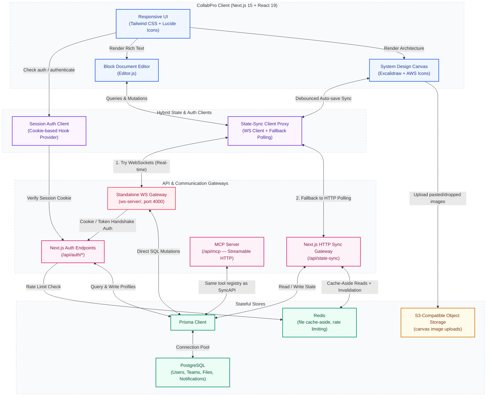

# Architecture Deep-Dive

This is the full technical deep-dive on how CollabPro is built. For a quick overview and setup instructions, see the [README](../README.md); for the MCP (AI agent) integration specifically, see [`mcp-integration.md`](mcp-integration.md); for Kubernetes deployment, see [`deploy-k8s.md`](deploy-k8s.md).

CollabPro is a **dual-channel, stateful real-time synchronization system**: a **WebSocket-first** topology with an automatic **HTTP adaptive-polling** fallback, backed by PostgreSQL, Redis, and S3-compatible object storage.

---

## 1. Topology Overview



**Note on the database:** PostgreSQL only (`prisma/schema.prisma`'s `datasource` is `postgresql`) — there is no SQLite fallback in the current codebase.

---

## 2. Standalone WebSocket Gateway (`ws-server/`)

The standalone WebSocket system (`ws-server/server.ts`) runs independently of the Next.js process, handling low-overhead real-time message routing:

- **Port**: reads `PORT`, then falls back to `WS_PORT`, then to `3001` if neither is set (`ws-server/server.ts`). This repo's own `.env.example` and `docker-compose.yml` both configure it to run on **4000** alongside the Next.js app on 3000.
- **Secure Upgrade & Token Handshake**: on the HTTP `upgrade` event, the gateway reads the session identifier from either the `Cookie` header (`session_token`) or a `?token=...` query parameter. A missing or invalid session aborts the socket upgrade with `401` before a WebSocket connection is ever established.
- **Multi-Room Multiplexing**: each connection is tracked as a `ClientConnection` with its authenticated user, active subscriptions, and joined workspace (`fileId`) rooms, so updates are only broadcast to sockets actually viewing that file.
- **Direct Database Write Flow**: mutations (`files:updateDocument`, `files:updateWhiteboard`) received over the socket are written directly via the shared Prisma client, then `broadcastQueryUpdateToRoom` re-reads and broadcasts the fresh state to every subscriber in that room.
- **Liveness Heartbeats**: a 30-second heartbeat pings every connection; sockets that don't respond before the next interval are terminated, preventing memory bloat from dead TCP connections.

---

## 3. Smart Adaptive-Backoff Polling

When WebSockets are unavailable (firewalls, VPNs, restrictive proxies), the client's `StateSyncClient` falls back to HTTP polling against `/api/state-sync` with a backoff controller:

```
[Active Tab / Interaction] ────────► 4s Polling Frequency
      │
      ├─► Tab Blurs / Hidden ─────────► 15s Polling Frequency
      │
      └─► User Inactive > 60s ────────► 15s Polling Frequency
            │
            └─► Real-Time Input ──────► Resumes Instantly to 4s
```

- **Active state**: polls every 4 seconds for near-real-time sync.
- **Tab blur**: backs off to 15 seconds the moment the tab loses visibility.
- **Inactivity**: backs off to 15 seconds after 60s with zero user input (mouse, scroll, keyboard, touch).
- **Resumption**: any local interaction instantly cancels the 15s timer and forces an immediate sync, restoring the 4s cadence.

---

## 4. Cache & Subscription Topology

- **Shared client cache**: resolved queries (from either a WebSocket broadcast or an HTTP poll) are keyed by reference + stringified args in a shared `Map`, so multiple components subscribing to the same data read from one source of truth instead of issuing duplicate requests.
- **Dual-mode sync controller**: a mutation/query first checks WebSocket liveness. If connected, it round-trips over the socket (10s timeout before falling back). If not, it POSTs to `/api/state-sync` instead.
- **Server-side Redis cache-aside** (`lib/redis-cache.ts`): file reads (`app/api/state-sync/services/fileService.ts`, `lib/mcp/tools.ts`) go through `cacheAside()` — a 600s-TTL Redis read-through cache — with every write path invalidating the corresponding key via `invalidateCachedFile()`. If Redis is unset or unreachable, `cacheAside` falls straight through to Postgres; there is no hard dependency on Redis for correctness, only for read latency.

---

## 5. Rate Limiting (`lib/rate-limiter.ts`)

Auth-adjacent endpoints (login, register, share-link password verification) are rate-limited with a **hybrid Redis/in-memory** design:

- If `REDIS_URL` is set, `checkRateLimit()` runs an atomic Lua script (`INCR` + conditional `PEXPIRE` in one round trip) against Redis, so the limit is enforced correctly across every replica/process.
- If Redis is unset, or a Redis call throws, it falls back to an in-process `Map`-based limiter — correct for a single replica, and keeps auth endpoints functional even during a Redis outage rather than failing open or closed.
- Limits are tuned per endpoint (e.g. 5 login attempts / 15 min per account, 30 / 15 min per IP) — see `LIMITS` in `lib/rate-limiter.ts` for the full table and the reasoning behind each threshold.

---

## 6. Object Storage (`lib/s3.ts`)

Canvas image uploads (pasted/dropped images on the Excalidraw canvas) go through an S3-compatible client (AWS SDK v3), configured via `S3_ENDPOINT` / `S3_ACCESS_KEY_ID` / `S3_SECRET_ACCESS_KEY` / `S3_BUCKET_NAME`. This works against AWS S3 itself or any S3-compatible service (e.g. MinIO, which is what `docker-compose.yml`'s local dev stack would point at). Base64 canvas images are converted to multipart uploads and replaced in-memory with short relative URLs before being persisted, keeping raw image data out of Postgres.

---

## 7. Operational Endpoints

- **`GET /api/health`** — liveness probe (`{ status: "ok", uptime }`), suitable for a platform health check.
- **`GET /api/admin/telemetry`** — infrastructure metrics (DB pool, cache status). Gated by an explicit `ADMIN_EMAILS` allowlist, not team/file ownership — it exposes global instance metrics, not per-tenant data, so team membership isn't a meaningful boundary for it. Fails closed (denies everyone) if `ADMIN_EMAILS` is unset.
