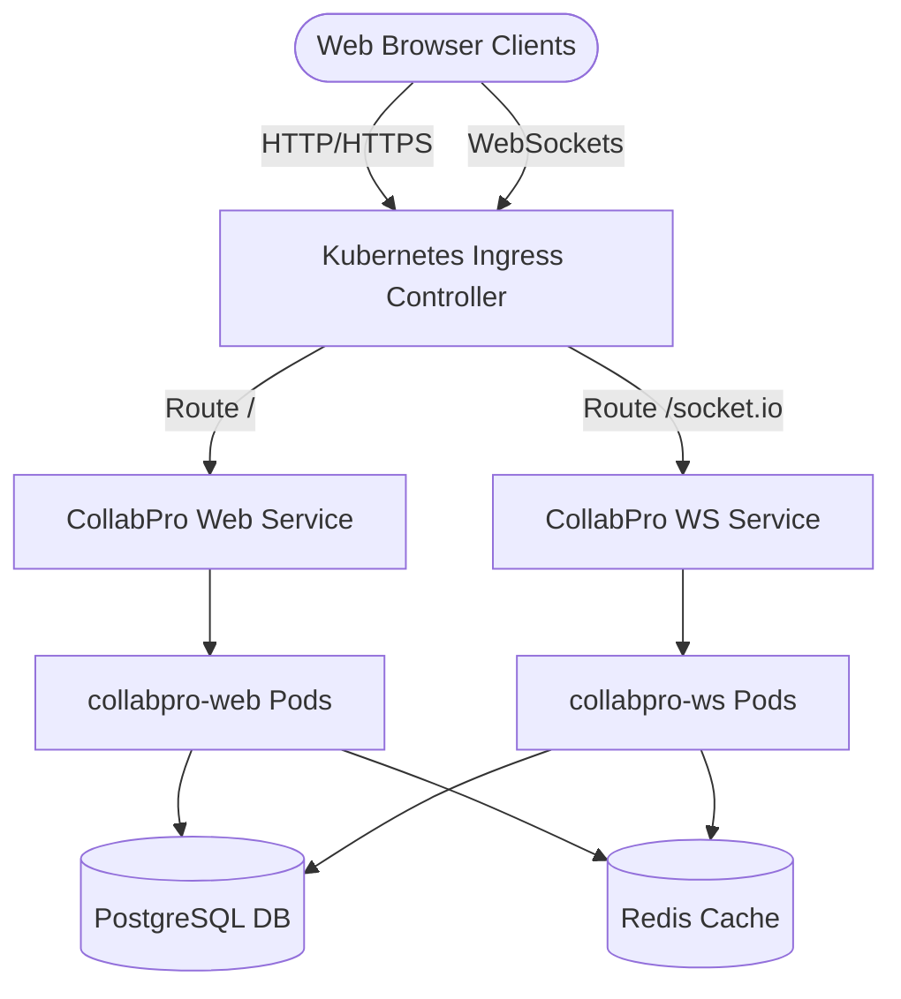

# CollabPro Kubernetes Deployment & Operations Guide

This guide describes how to deploy, configure, and operate the CollabPro application stack on any standard Kubernetes cluster (EKS, GKE, AKS, or microk8s/minikube) using our production Helm Chart.

---

## 🏗️ Architecture Overview

The CollabPro architecture is structured as a decoupled, resilient system containing:
1. **Next.js Web App (`web`):** Responsive frontend and synchronous API route param handlers.
2. **WebSocket Gateway (`ws`):** State-sync real-time canvas collaboration service.
3. **PostgreSQL database Store:** Relation-generic database server containing system users, organizations, files, and compliance audit logs.
4. **Redis Cache Store:** High-performance database cache and notification processing queue.



---

## 📋 Prerequisites

To deploy CollabPro, make sure your environment includes:
* **Kubernetes Cluster** version 1.25 or higher.
* **Helm 3** package manager client binary installed.
* **kubectl CLI** configured with administrator context to your target cluster namespace.
* A working **Ingress Controller** (e.g., NGINX Ingress Controller) if you wish to expose CollabPro outside the cluster boundaries.

---

## ⚡ Step-by-Step Installation

### Step 1: Clone the Repository & Navigate to Charts
Ensure you are in the project workspace root:
```bash
cd collabpro
```

### Step 2: Validate Helm Templates Locally
Before running any installation command, use Helm dry-run parsing to verify all template substitutions render properly:
```bash
helm template collabpro ./charts/collabpro --values ./charts/collabpro/values.yaml
```

### Step 3: Install the Chart
Deploy the CollabPro application stack inside your target namespace (create one if it does not exist):
```bash
kubectl create namespace collabpro-prod
helm install collabpro ./charts/collabpro --namespace collabpro-prod --values ./charts/collabpro/values.yaml
```

---

## ⚙️ Configuration Parameters

The following parameters are customizable via `./charts/collabpro/values.yaml`:

| Parameter | Description | Default Value |
|-----------|-------------|---------------|
| `replicaCount.web` | Desired replicas of Next.js instances | `2` |
| `replicaCount.ws` | Desired replicas of WebSocket gateways | `2` |
| `image.repository.web` | Web container image repository | `collabpro/web` |
| `image.repository.ws` | WS container image repository | `collabpro/ws` |
| `postgres.enabled` | Install PostgreSQL in-chart instance | `true` |
| `postgres.persistence.size` | Storage capacity allocated to DB | `8Gi` |
| `redis.enabled` | Install Redis in-chart instance | `true` |
| `resources.web.limits.memory` | Maximum memory usage for web container | `1536Mi` |

---

## 🔒 Security Best Practices Enforced

This chart adheres to standard **Kubernetes Security Context Hardening**:
* **Non-root contexts:** Web and WS containers execute under the non-privileged `nextjs` user (`uid 1001`, `gid 1001`).
* **Capability Restrictions:** All container capabilities (`drop: [ALL]`) are dropped by default to prevent root escalation vectors.
* **Resource Quotas:** Memory and CPU limits are explicitly configured on every pod to guarantee predictability and eliminate OOM eviction storms.

---

## 🛠️ Operations & Troubleshooting

### Check Pod Statuses
```bash
kubectl get pods -n collabpro-prod
```

### View Application Logs
```bash
# Get Next.js frontend logs
kubectl logs -f deployment/collabpro-web -n collabpro-prod

# Get WebSocket gateway server logs
kubectl logs -f deployment/collabpro-ws -n collabpro-prod
```

### Run DB Push/Migrations Manually
The Next.js container automatically executes database migrations during startup via `prebuild`/`start` script triggers. If you ever need to manually force schema pushes, spin up a transient interactive pod:
```bash
kubectl exec -it deploy/collabpro-web -n collabpro-prod -- npx prisma db push
```
